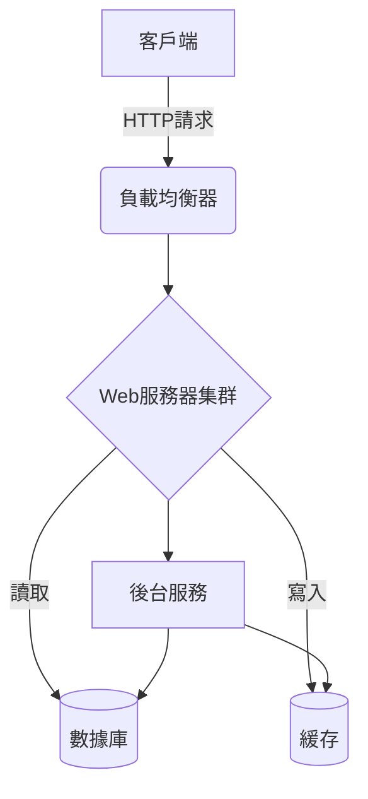

# PizzaFlix

This is a website where user can Browse the most up-to-date movie/tv show information.
Take a look! -> [PizzaFlix](https://pizza-flix.vercel.app/)

- [Features](#features)
- [How to start app locally](#how-to-start-app-locally)
- [Technologies](#technologies)

## Features

- Login/Logout
- Password Update
- Account Password Encryption
- Browse review
- Write/Delete review
- Add/Delete movie to favorites
- Search movie/cast/tv show
- Dark/Light mode switch
- Responsive Web Design
- Interactive slider

## How to start app locally

1. clone/fork this repo
2. download [mongoDB](https://www.mongodb.com/docs/manual/installation/)
3. create a database -> `use myDB-name`
4. register [The Movie Database](https://www.themoviedb.org/signup) account
5. generate [API key](https://www.themoviedb.org/settings/api)
6. create `.env` in `/server`

/server/.env

```py
MONGODB_URL = mongodb://127.0.0.1:27017/<your-db-name> # replace it with your db name
PORT = 5000
TOKEN_SECRET = <your_secret_key> # random string
TMDB_BASE_URL = https://api.themoviedb.org/3/
TMDB_API_KEY = <your-tmdb-api-key> # replace it with your API key
```

7. `npm install` `cd /server` `npm start`
8. create new terminal `cd /client` `npm start`

## Technologies

### Front end

- Create react app
- Material UI
- SwiperJS
- React router
- Formik
- Yup
- Axios

### Back end

- Express rest api
- Express Validator
- Jsonwebtoken
- Mongoose
- Axios

## Structure


